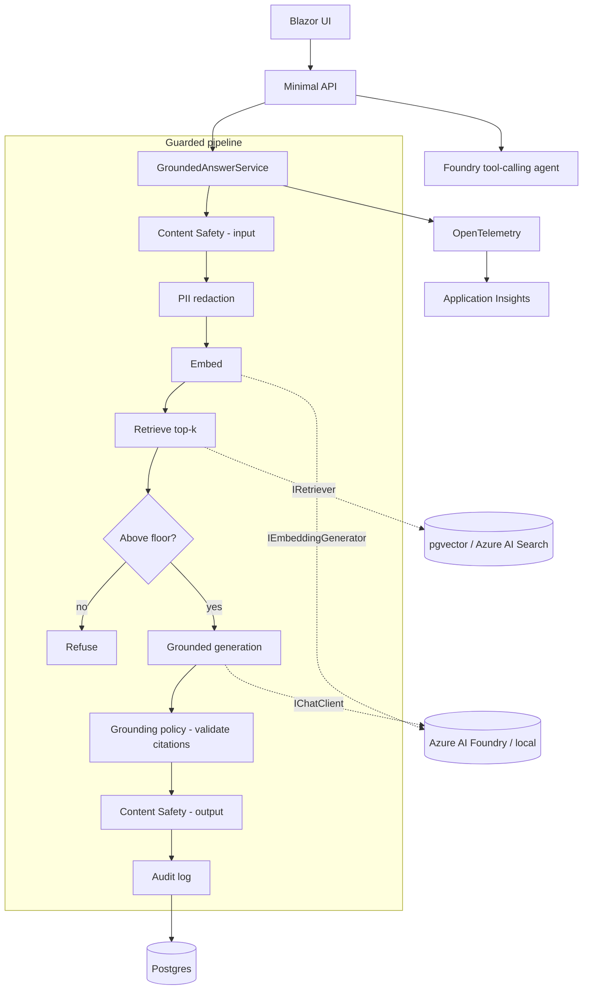
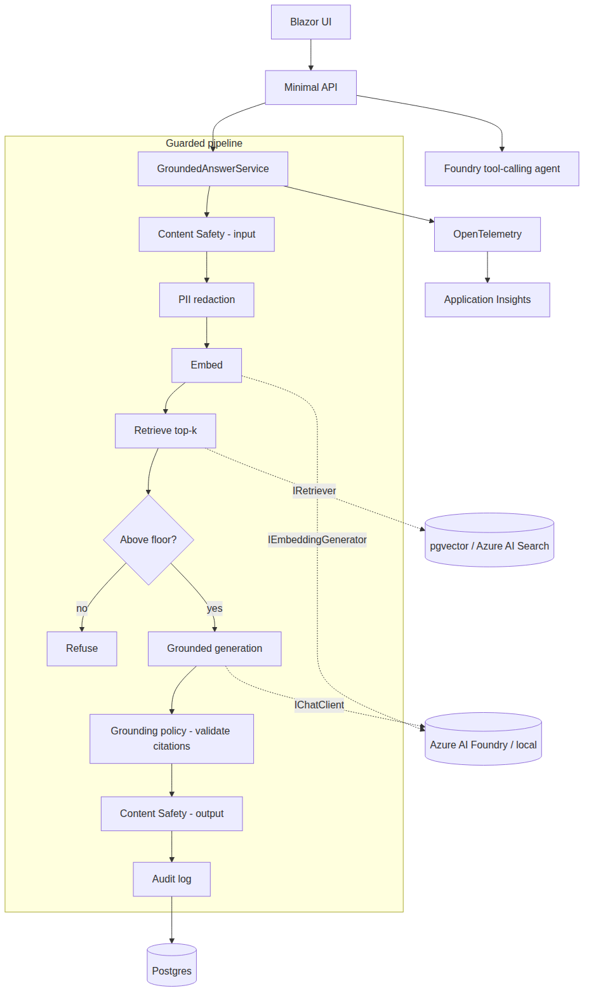

# FCA Handbook Assistant - an AI-DevOps reference implementation

This project is a deliberately small but complete example of taking AI to production on Azure in a
regulated setting. It answers compliance questions over the public FCA Handbook with grounded,
cited answers, and it treats the things that actually matter in regulated AI - grounding, refusal,
auditability, evals, and observability - as first-class, testable requirements rather than polish.

## Why it is shaped this way

Three audiences read a project like this: an engineering lead (is the .NET sound?), an AI lead (is
the grounding real, or a demo?), and a platform/LLMOps lead (can this be operated?). The design
answers all three at once:

- **Production .NET** - a clean, layered solution behind interfaces, test-first, with unit,
  integration, and eval suites.
- **A real AI service layer** - Microsoft Agent Framework over Azure AI Foundry, with a
  deterministic local implementation so the whole system runs, and is tested, without the cloud.
- **LLMOps** - Terraform IaC, CI/CD, evals that gate the build, and cost/latency/quality telemetry.

## Architecture

## The guardrails are the point

Grounding is enforced by code, not trusted to the model:

1. Retrieval below a similarity floor refuses without ever calling the model.
2. The model is prompted only with the retrieved provisions and must cite each claim.
3. A deterministic policy drops any citation to a provision that was not retrieved; if none survive,
   the answer is refused. Citation URLs are rewritten to the authoritative Handbook links.
4. Every question - answered or refused - is written to an audit record: retrieved vs cited
   provisions, model and prompt version, safety verdicts, latency, and token counts.

This is exactly what the evals test. The CI eval gate drives the real pipeline through the regulated
scenarios (grounded answer, refuse-when-unsure, planted hallucination, partial hallucination) with
deterministic fakes and fails the build if refusal correctness drops or a hallucinated citation
survives. A separate, env-gated run measures quality against the live model and writes a report.

## The AI-service seam

Everything the model touches depends on `Microsoft.Extensions.AI` interfaces. A deterministic local
implementation (hashing-trick embeddings, a grounded chat client that reads the retrieved provisions)
lets the entire system run and be tested offline; the same code targets Azure AI Foundry in the
cloud. The tool-calling agent uses the code-first Microsoft Agent Framework Foundry Responses agent
with three function tools, subject to the same grounding discipline.

## LLMOps

- **IaC** - Terraform provisions AI Foundry (chat + embedding deployments), Postgres with pgvector,
  Container Apps (scale-to-zero), Azure AI Search, Content Safety, Application Insights, and Key
  Vault with a managed identity. Resources follow the Cloud Adoption Framework naming convention.
- **CI/CD** - format/build/test, Terraform fmt/validate/tflint/trivy, CodeQL, and gitleaks on every
  push; a manual, OIDC-authenticated deploy/destroy workflow.
- **Observability** - OpenTelemetry to Application Insights, with custom metrics for refusal rate,
  citations, token cost, and latency, and a workbook.
- **Cost discipline** - consumption/serverless tiers only, and deploy-capture-destroy each session.

## Handbook content and copyright

The FCA Handbook is Crown/FCA copyright, published for use but not for wholesale redistribution. The
real provision text is fetched with a headless browser (the Handbook is a single-page app), stored
for retrieval in the database, and never committed to the repo; every answer links back to the
authoritative provision.
